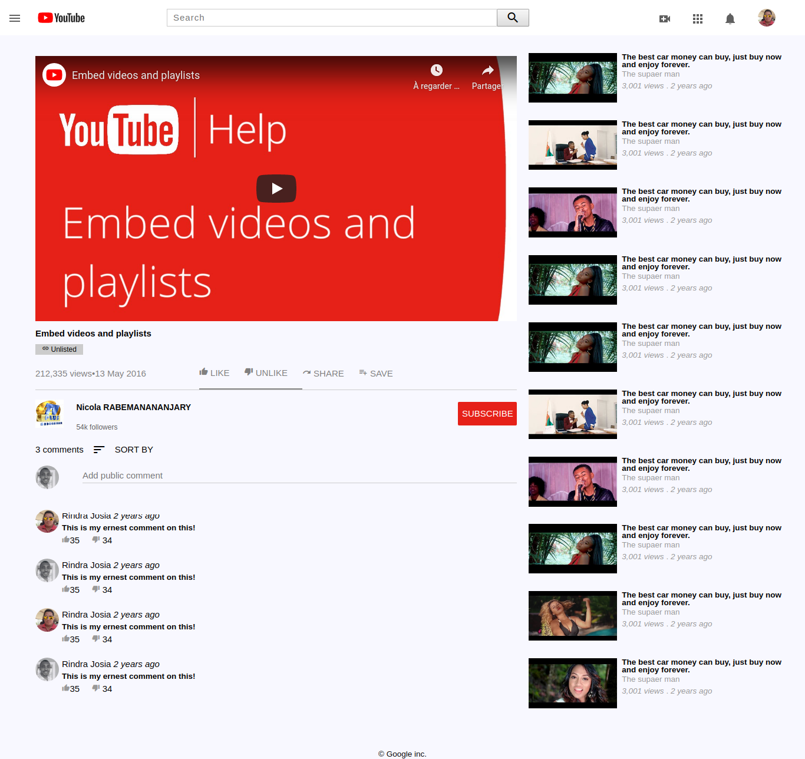

# Embedding Images and Video: Youtube clone web page
This project an exact replica of the YouTube video page.

The goal here is to focus on making the media elements show up.
That means two things – embedding the YouTube video player into the page so it actually plays and showing little thumbnail images along the right side.

# Built With
* HTML
* CSS
* fonts.googleapis.com
* w3.css

# Live Demo
https://raw.githack.com/gabrie-lhilarion/youtube-homepage/feature-one/index.html

# Getting Started

# Authors

gabrie-lhilarion

*Github: @gabrie-lhilarion

rindra josia

*Github: @rindrajosia

#  Contributing

Contributions, issues and feature requests are welcome!

#  Show your support

Give a star if you like this project!
